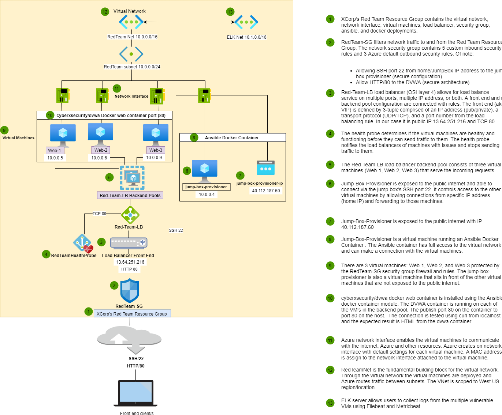

## Automated ELK Stack Deployment

The files in this repository were used to configure the network depicted below.

These files have been tested and used to generate a live ELK deployment on Azure. They can be used to either recreate the entire deployment pictured above. Alternatively, select portions of the playbook files may be used to install only certain pieces of it, such as Filebeat.

This document contains the following details:
- Description of the Topology
- Access Policies
- ELK Configuration
  - Beats in Use
  - Machines Being Monitored
- How to Use the Ansible Build

### Description of the Topology

The main purpose of the Azure virtual network is to expose a load-balanced and monitored instance of DVWA, the D*mn Vulnerable Web Application. 

Load balancing ensures that the application will be highly available, in addition to restricting inbound access to the network.Azure provisions a load balancer, in this case Red-Team-LB in front of all the machines; Web-1, Web-2, Web-3 are all virtual machines that also function as load-balanced web servers. The load balancer distributes inbound flows that arrive at the load balancer's front end to backend pool instances. These flows are distributed according to configured load-balancing rules and health probes. The three deployed virtual machines to the Azure network are secured by configuration; Vnet security group and accessing the server is configured with SSH key pair access only. The cloud network was created and protected before placing any VM's inside of it; with a firewall and all traffic was blocked to this network to ensure an attacker would not gain access during the configuration process. 

Integrating an ELK server allows users to easily collect logs from multiple vulnerable VMs for changes to the file system (Filebeat) and system health metrics (Metricbeat); such important monitoring features also include CPU usage, uptime, ssh logins and/or failures of the VMs on the network. In addition, an ELK stack allows SOC analysts to quickly execute complex searches and build visualizations of the network data - in other words, this allows for monitoring of the performance of the web server that is running DVWA. 

The configuration details of each machine deployed may be found below. 

| Name     | Function | IP Address | Operating System |
|----------|----------|------------|------------------|
|Jump Box  |Gateway   |10.0.0.4    |Linux             |
|Web-1     |Web Server|10.0.0.5    |Linux             |
|Web-2     |Web Server|10.0.0.6    |Linux             |
|Web-3     |Web Server|10.0.0.9    |Linux             |
|ELK       |Container |10.1.0.4    |Linux             |

### Access Policies

The machines on the internal network are not exposed to the public Internet. 

Jump Box is exposed to the public internet and able to connect via the Jump Box's SSH port 22. It controls access to the other virtual machines by allowing connections from specific IP address (Home IP) and forwarding to those machines. 

Machines within the network can only be accessed by each other (Web-1, Web-2, Web-3). The Jump Box is the only machine allowed to access the ELK stack. 

A summary of the access policies in place can be found in the table below.

| Name     | Publicly Accessible | Allowed IP Addresses |
|----------|---------------------|----------------------|
| Jump Box | Yes                 |  Home IP      |
| ELK      | No                  |  10.0.0.4            |
| DVWA 1   | No                  |  10.0.0.4            |
| DVWA 2   | No                  |  10.0.0.4            |
| DVWA 3   | No                  |  10.0.0.4            |

### Elk Configuration

Jump Box is a virtual machine running an Ansible Docker container. The Ansible container has full access to the virtual network and can make a connection with the virtual machines. Ansible was used to create infrastructure connections to VMs inside the virtual network. Ansible was used to automate configuration of the ELK machine. No configuration was performed manually, which is advantageous because it's easier if the configuration for all of the VMs, containers, and networks in the deployment are defined in text files (IaC), which you can use with provisioners to automatically recreate machines and networks whenver necessary. The primary benefit of IaC is that everyone sees exactly how the network is configured by reading text files. These can easily be version controlled in a tool like Git and Continuous Integration/Deployment is automatically updating your machines whenever your IaC file changes. Containers simplify and expedite deployment of custom machine networks, provisioners eliminate human error in the configuration process, and IaC allows engineers to describe all of their network and VM configurations in simple text files. 

Working torwards a fully reproducible, continuous integration and automated deployment process we used Docker (a provisioning tool) to install Ansible. These "lightweight VMs"/containers using Docker are smaller as they use fewer resources by sharing the resources they have in common with other containers. Ansible also allows for playbooks to configure and run on certain machines and/or groups of machines. 

Now that Docker container that runs on Ansible has been installed, the playbook implements the following tasks to connect our Ansible to a new VM:
- First ssh admin@jump-box-ip
- Once you are connected, you need to get the container up and running. It is important to note that docker run should only be used the first time the Ansible container is created/started. Docker start should be used every time after or else Ansible files and changes will not be there. 
- You need to make sure you are only running one container and it is the same container every time you use Ansible. 
- Run docker container list -a 
- In this case it is cyberxsecurity/ansible and you will run sudo docker attach container_name 
- Your promot will change and you will now be connected to the Ansible Docker container 

sudo apt-get install -y docker.io
sudo systemctl start docker
sudo docker pull cyberxsecurity/ansible
sudo docker run --mount type=bind,src=/home/azureuser/.ssh,dst=/root/.ssh --mount type=bind,src=/home/azureuser/ansible,dst=/etc/ansible  -it cyberxsecurity/ansible /bin/bash

The following screenshot displays the result of running `docker ps` after successfully configuring the ELK instance.

### Target Machines & Beats
This ELK server is configured to monitor the following machines:
- 10.0.0.5 Web-1 
- 10.0.0.6 Web-2
- 10.0.0.9 Web-3 

We have installed the following Beats on these machines:
- Filebeat and Metricbeat 10.0.0.5
- Filebeat and Metricbeat 10.0.0.6
- Filebeat and Metricbeat 10.0.0.8

These Beats allow us to collect the following information from each machine:
- Filebeat: monitors files on disk for changes and watches system events, such as user logins. 
- Metricbeat: monitors system health metrics, such as uptime. It also generates metrics based on Apache access logs. 

### Using the Playbook
In order to use the playbook, you will need to have an Ansible control node already configured. Assuming you have such a control node provisioned: 

SSH into the control node and follow the steps below:
- Copy the configuration and playbook files to /etc/ansible/ directory. 
- Update the ansible and host file to include the following: 

Run ansible
Now in order to let Ansible make connections to the Vm we must make two changes to the configuration files located in /etc/ansible/ directory. 
- Ansible needs to know the Administrative user name to use when making SSH connections (Admin username used when created the Web-VMs); ansible.cfg is the file with the setting for the admin name that should be used 
- Ansible needs to know the IP address of the VM you want it to connect to; hosts.cfg is the file with all of the IP addresses that should be used under the webservers group 

Next, you will need to add a python script on the target machine using that machine's installation of Python on the ELK server. 

Finally save the config files and verify these connections by running ansible webservers - m ping or ansible all -m ping (for all the webservers) 

- Run the playbook, and navigate to kibana by run curl command to the kibana IP to check that the installation worked as expected.

